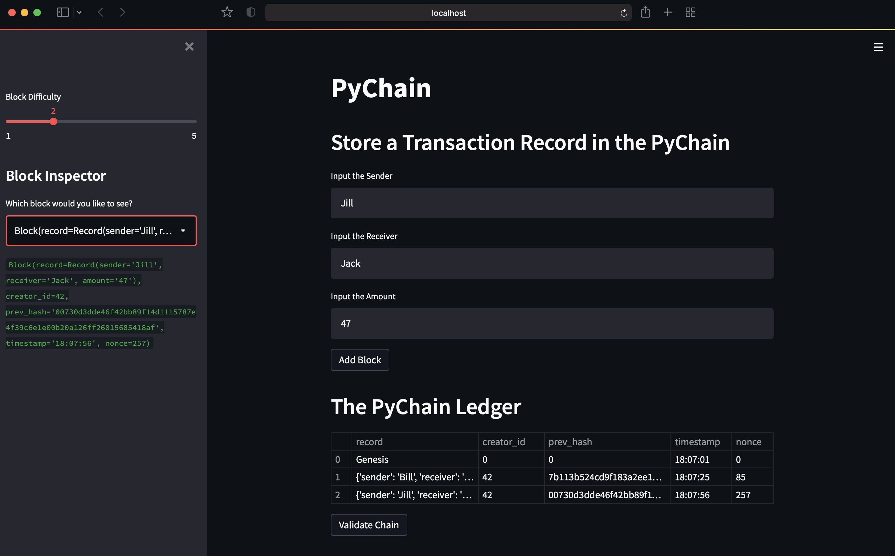
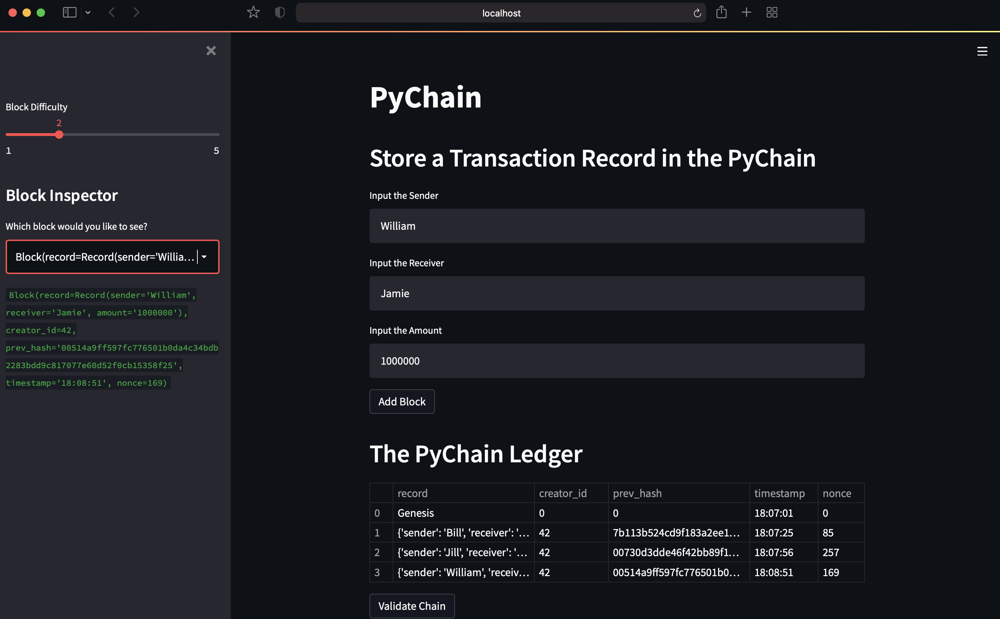
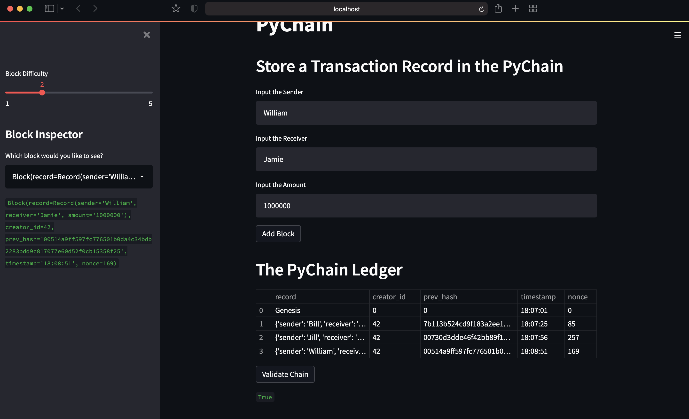

# Challenge_18
# Building a Blockchain Using Python

The goal of this project was to build and test an instance of a blockchain using Python and Streamlit. This blockchain was built to store transactional data for sending a specified amount between two parties. The bolckchain uses hashing and proof of work to ensure its validity. Additionally, a Streamlit application was built to allow users a more friendly experience with which to interact with the blockchain. 

---

## Technologies

This project is built in Python 3.6 and designed to be using the command line. In order to properly utilize the project, the following Python libraries will be imported and used:

   [pandas](https://pandas.pydata.org/docs/)

   [streamlit](https://docs.streamlit.io/)

   [typing](https://docs.python.org/3/library/typing.html)
   
   [datetime](https://docs.python.org/3/library/datetime.html)
   
   [dataclasses](https://docs.python.org/3/library/dataclasses.html)
   
   [hashlib](https://docs.python.org/3/library/hashlib.html)


---

## Installation Guide

The streamlit library is not included in the base Python can be installed using the pip install syntax. The others are imported within the project file. 

```python
pip install streamlit
```


---

## Usage

Once the streamlit library has been installed into a Python environment, the user can run the project by navigating into the Challenge_18 directory using the command line. When in the directory, the user can run the following command to deploy the application: 

```python
streamlit run pychain.py
```

This command will then launch the application and create a local instance of the blockchain. The webpage application allows the user to add new blocks to the chain, adjust the difficulty of mining new blocks, and test the validity of the existing chain. 

---

## Web Deployment and Block Addition 

Addition of 2 New Blocks


Addition of 1 More New Block


---

## Validation Test




---

## Contributors

Briggs Lalor
email: briggsclalor@gmail.com

---

## License

MIT License

Copyright (c) [2021] [Briggs Lalor]

Permission is hereby granted, free of charge, to any person obtaining a copy
of this software and associated documentation files (the "Software"), to deal
in the Software without restriction, including without limitation the rights
to use, copy, modify, merge, publish, distribute, sublicense, and/or sell
copies of the Software, and to permit persons to whom the Software is
furnished to do so, subject to the following conditions:

The above copyright notice and this permission notice shall be included in all
copies or substantial portions of the Software.

THE SOFTWARE IS PROVIDED "AS IS", WITHOUT WARRANTY OF ANY KIND, EXPRESS OR
IMPLIED, INCLUDING BUT NOT LIMITED TO THE WARRANTIES OF MERCHANTABILITY,
FITNESS FOR A PARTICULAR PURPOSE AND NONINFRINGEMENT. IN NO EVENT SHALL THE
AUTHORS OR COPYRIGHT HOLDERS BE LIABLE FOR ANY CLAIM, DAMAGES OR OTHER
LIABILITY, WHETHER IN AN ACTION OF CONTRACT, TORT OR OTHERWISE, ARISING FROM,
OUT OF OR IN CONNECTION WITH THE SOFTWARE OR THE USE OR OTHER DEALINGS IN THE
SOFTWARE.
